# AGENTE 15 — INVENTÁRIO DE RELATÓRIOS EXTRAS
**Documento de Auditoria e Mapeamento de Relatórios/Cards Fora do Catálogo Oficial dos 50 Cards**  
**Data:** 02/09/2026  
**Repositório:** Acompanhamento Comercial AtlasGR e Total Trac  

---

## 1. Visão Geral e Executiva

O presente inventário foi elaborado pelo **AGENTE 15** com a finalidade de auditar, categorizar e avaliar todos os relatórios, dashboards, visualizações e handlers presentes no repositório que **não pertencem à lista oficial dos 50 cards do Catálogo Mestre da Central de Inteligência Comercial (CPI)**.

Embora o Catálogo Mestre estabeleça 50 cartões/relatórios oficiais (estendidos por 8 hubs de comando de 51 a 58), o repositório acumula historicamente **35 relatórios e handlers adicionais**. Esses relatórios extras variam desde módulos táticos valiosos (como `opportunity_health_score`, `data_trust_score`, `pipeline_velocity` e `receita_em_risco`) até relatórios hiper-específicos de SDR, utilitários operacionais de higiene de dados e relatórios estáticos congelados em HTML.

### Resumo Numérico do Inventário

- **Total de Relatórios / Handlers Extras Mapeados:** 35
- **Recomendação - Manter / Promover como Motor Oficial:** 6 (17,1%)
- **Recomendação - Integrar a um dos 50 Cards / Hubs:** 24 (68,6%)
- **Recomendação - Remover / Arquivar (Stubs / HTML Estático):** 3 (8,6%)
- **Recomendação - Melhorar / Refatorar:** 2 (5,7%)

---

## 2. Tabela Consolidada do Inventário

| # | Nome / Chave | Arquivo / Handler | Finalidade Principal | Sobreposição com os 50 Cards | Recomendação |
|---|---|---|---|---|---|
| 01 | `vendas_realizadas` | `js/catalogo-relatorios.js:365` | Negócios ganhos por dia/mês/ano por vendedor | Card 01, Card 02, Card 12 | **Integrar** (Card 12 e Card 01) |
| 02 | `reunioes_sdr` | `js/catalogo-relatorios.js:1071` | Reuniões agendadas/realizadas/no-show (atividades + stagehistory) | Card 52 (SDR Command Center), Card 33 | **Integrar** (Card 52 e Card 33) |
| 03 | `analise_sdr` / `performance_sdr` | `js/sdr.js` & `js/catalogo-relatorios.js:883` | Performance completa de SDRs com comparação WoW/MoM | Card 52 (SDR Command Center), Card 53 | **Integrar** (Promover a motor do Card 52) |
| 04 | `data_trust_score` | `js/data-trust-score.js` | Avaliação de governança e confiabilidade dos dados (0-100, A+ a F) | Card 51 (Data Trust Center) | **Manter / Evoluir** (Motor do Card 51) |
| 05 | `qualidade_crm` | `js/catalogo-relatorios.js:732` | Completude % de 9 campos operacionais em Deals e Leads | Card 51 (Data Trust Center) | **Integrar** (Fundir ao Card 51) |
| 06 | `auditoria_sdr` | `js/catalogo-relatorios.js:752` | Auditoria de leads sem atividade e abertos estagnados (7d+) | Card 53 (SDR Quality & Recovery), Card 46 | **Integrar** (Card 53) |
| 07 | `sla_primeiro_contato` | `js/catalogo-relatorios.js:452` | Tempo em horas até primeira atividade no Lead contra SLA | Card 52 (SDR Command Center), Card 25, Card 33 | **Integrar** (Card 52 e Card 33) |
| 08 | `produtividade_atividades` | `js/catalogo-relatorios.js:444` | Volume e canais de atividades concluídas por usuário | Card 12 (Seller Performance), Card 52 | **Integrar** (Card 12 e Card 52) |
| 09 | `atividades_pendentes` | `js/catalogo-relatorios.js:500` | Tarefas abertas atrasadas ou vencendo por responsável | Card 58 (Action Center), Card 34 | **Integrar** (Card 58 e Card 34) |
| 10 | `handoffs` | `js/catalogo-relatorios.js:461` | Trocas de responsável (`ASSIGNED_BY_ID`) entre Leads/Deals | Card 43 (Funnel Leakage), Card 23 | **Integrar** (Card 43) |
| 11 | `reentradas` | `js/catalogo-relatorios.js:471` | Retrabalho e retorno a etapas/funis anteriores | Card 43 (Funnel Leakage), Card 35 | **Integrar** (Card 43 e Card 35) |
| 12 | `duplicidades` | `js/catalogo-relatorios.js:480` & `js/entity-resolution.js` | Sinais cadastrais de duplicidade em empresas e pipelines | Card 51 (Data Trust Center), Card 50 | **Integrar** (Card 51 e Card 50) |
| 13 | `implantacao_posvenda` | `js/catalogo-relatorios.js:489` | Acompanhamento de funis de Onboarding/CS e SLA 30d | Card 23 (Customer Lifecycle), Card 26 | **Integrar** (Card 26 e Card 23) |
| 14 | `decisao_final_sdr` | `js/catalogo-relatorios.js:1039` | Sugestão de ações táticas para leads estagnados (15d+) | Card 53 (SDR Quality & Recovery), Card 58 | **Integrar** (Card 53 e Card 58) |
| 15 | `funil_leads` | `js/catalogo-relatorios.js:435` | Distribuição de status dos leads e conversão para Opp/Ganho | Card 47 (Conversão por Coorte), Card 52 | **Integrar** (Card 47) |
| 16 | `contact_rate` | `js/catalogo-relatorios.js:781` | Proporção de leads com contato efetivo vs trabalhados | Card 52 (SDR Command Center), Card 33 | **Integrar** (Card 52) |
| 17 | `meeting_rate` | `js/catalogo-relatorios.js:794` | Taxa de agendamento de reuniões e Show Rate | Card 52 (SDR Command Center), Card 33 | **Integrar** (Card 52) |
| 18 | `no_show_sdr` | `js/catalogo-relatorios.js:809` | Reuniões no-show e taxa de recuperação posterior | Card 53 (SDR Quality & Recovery) | **Integrar** (Card 53) |
| 19 | `tentativas_conversao` | `js/catalogo-relatorios.js:827` | Distribuição estatística (média, med, P75, P90) de tentativas | Card 42 (Sales Velocity), Card 52 | **Melhorar / Integrar** (Card 52 e Card 42) |
| 20 | `receita_sdr` | `js/catalogo-relatorios.js:870` | Receita fechada gerada a partir de leads trabalhados por SDR | Card 52 (SDR Command Center), Card 12 | **Integrar** (Card 52) |
| 21 | `pipeline_novo_gerado` | `js/catalogo-relatorios.js:507` | Pipeline criado no dia/semana/mês por vendedor | Card 33 (Leading Indicators), Cockpit | **Integrar** (Card 33) |
| 22 | `pipeline_carryover` | `js/catalogo-relatorios.js:520` | Stub estático sem dados históricos de CLOSEDATE | Card 41 (Pipeline Movement Waterfall) | **Remover / Substituir** (Card 41) |
| 23 | `closedate_intelligence` | `js/catalogo-relatorios.js:525` | Higiene de datas no pipeline aberto (ausentes/vencidas) | Card 46 (Deal Risk), Card 51 | **Integrar** (Card 46 e Card 51) |
| 24 | `opportunity_health_score` | `js/catalogo-relatorios.js:539` | Score de saúde de 0 a 100 por oportunidade (pesos parametrizáveis) | Card 46 (Deal Risk), Card 34 | **Manter / Integrar** (Motor do Card 46/34) |
| 25 | `pipeline_velocity` | `js/catalogo-relatorios.js:557` | Velocidade financeira (R$/dia) e projeção mensal por vendedor | Card 42 (Sales Velocity) | **Manter / Promover** (Motor do Card 42) |
| 26 | `receita_em_risco` | `js/catalogo-relatorios.js:563` | Volume financeiro em risco por estagnação/inatividade | Card 31 (Revenue at Risk) | **Manter / Promover** (Motor do Card 31) |
| 27 | `motivos_ganho_perda` | `js/catalogo-relatorios.js:570` | Motivos e estágios de fechamento em dados reais Bitrix | Card 38 (Driver Analysis), Card 43 | **Integrar** (Card 38) |
| 28 | `clientes_receita` | `js/catalogo-relatorios.js:426` | Receita por cliente, recorrência e curva Top 1/5/10 | Card 50 (Customer 360), Card 38 | **Integrar** (Card 50) |
| 29 | `produtos_receita` | `js/catalogo-relatorios.js:415` | Vendas por produto, linhas de produto e participação no mix | Card 10 (Product 360), Card 11 | **Manter / Promover** (Motor do Card 10/11) |
| 30 | `aging_sla` | `js/catalogo-relatorios.js:344` | Tempo de permanência no estágio atual contra SLA (30d) | Card 46 (Deal Risk), Card 42 | **Integrar** (Card 46) |
| 31 | `diario_sdr` | `js/sdr.js` | Interface operacional diária com tarefas e cadência SDR | Card 52 (SDR Command Center), Card 58 | **Manter / Integrar** (View do Card 52) |
| 32 | `jornada_cliente` | `js/jornada.js` | Linha do tempo E2E do cliente (Lead → Opp → PosVenda) | Card 23 (Customer Lifecycle), Card 50 | **Manter / Integrar** (Timeline do Card 50/23) |
| 33 | `diagnostico_sdr_joao_reis` | `diagnostico-sdr-joao-reis-jul-ago-2026.html` | Arquivo HTML estático de diagnóstico pontual | Card 52 (SDR Command Center) | **Remover / Arquivar** |
| 34 | `auditoria_gerhai_2026` | `auditoria-gerhai-2026.html` | Arquivo HTML estático de auditoria do portal Gerhai | Card 39 (Executive Intelligence Report) | **Remover / Arquivar** |
| 35 | `staging_bronze_ingestion_audit` | `js/staging-schema.js` & `db/migrations/002_*.sql` | Auditoria técnica e semântica de ingestão da camada Bronze | Card 51 (Data Trust Center) | **Integrar** (Infra do Card 51) |

---

## 3. Detalhamento Técnico e Estratégico dos Relatórios Extras

### 3.1 Mapeamento da Categoria: Gestão Comercial & Performance (`vendas_realizadas`, `pipeline_velocity`, `receita_em_risco`, `produtos_receita`, `clientes_receita`, `motivos_ganho_perda`, `aging_sla`, `pipeline_novo_gerado`, `pipeline_carryover`)

1. **`vendas_realizadas`**
   - **Handler:** `js/catalogo-relatorios.js:365`
   - **Análise:** Filtra negócios em estágio de sucesso (`_SEMANTICA = "success"`) e agrega valor e ticket médio por vendedor em três tabelas: Diário, Mensal e Anual.
   - **Sobreposição:** Coincide com o conceito de "Vendido" do Card 01 (*Vendido x Faturado*) e com as métricas de receita do Card 12 (*Seller Performance 360*).
   - **Ação Recomendada:** **Integrar**. O handler deve ser reaproveitado como a aba de detalhamento temporal do Card 12 e do Card 01, eliminando a duplicação no menu raiz do extrator.

2. **`pipeline_velocity`**
   - **Handler:** `js/catalogo-relatorios.js:557`
   - **Análise:** Aplica a fórmula clássica de velocidade de vendas: $\text{Velocidade (R\$/dia)} = \frac{\text{Deals Ganhos} \times \text{WinRate} \times \text{Ticket Médio}}{\text{Ciclo Médio (dias)}}$. Calcula também a projeção mensal (30 dias) individual por vendedor.
   - **Sobreposição:** É a implementação exata da especificação do **Card 42 (Sales Velocity)** do Catálogo Mestre.
   - **Ação Recomendada:** **Manter / Promover**. Formalizar este código como o motor canônico do Card 42.

3. **`receita_em_risco`**
   - **Handler:** `js/catalogo-relatorios.js:563`
   - **Análise:** Mapeia oportunidades abertas que apresentam fatores de risco simultâneos ou isolados: estagnação acima do SLA, inatividade > 14 dias ou CLOSEDATE ausente/vencida.
   - **Sobreposição:** Trata-se da implementação direta do **Card 31 (Revenue at Risk)**.
   - **Ação Recomendada:** **Manter / Promover**. Promover ao Card 31 oficial.

4. **`produtos_receita`**
   - **Handler:** `js/catalogo-relatorios.js:415`
   - **Análise:** Faz chamadas ao endpoint `crm.deal.productrows.get` para extrair os produtos vinculados a negócios ganhos, calculando quantidade, receita total por produto e participação percentual no mix.
   - **Sobreposição:** Corresponde diretamente aos **Cards 10 (Product Performance 360)** e **11 (Product Mix Evolution)**.
   - **Ação Recomendada:** **Manter / Promover**. Manter e conectar oficialmente aos Cards 10 e 11.

5. **`clientes_receita`**
   - **Handler:** `js/catalogo-relatorios.js:426`
   - **Análise:** Consolida negócios ganhos por cliente (utilizando `COMPANY_ID` ou nome normalizado), apontando recorrência de compras e concentração de receita (Top 1, Top 5 e Top 10).
   - **Sobreposição:** Sobrepõe-se ao **Card 50 (Customer 360)** e ao **Card 38 (Driver Analysis)**.
   - **Ação Recomendada:** **Integrar**. Incorporar como o painel financeiro de curva de concentração dentro do Card 50 (Customer 360).

6. **`motivos_ganho_perda`**
   - **Handler:** `js/catalogo-relatorios.js:570`
   - **Análise:** Categoriza fechamentos por resultado (ganho vs. perda) e por motivo/estágio final lido do Bitrix (`STAGE_ID`, `ADDITIONAL_INFO`, campos customizados `UF_CRM_*`).
   - **Sobreposição:** Sobrepõe-se ao **Card 38 (Driver Analysis)** e **Card 43 (Funnel Leakage)**.
   - **Ação Recomendada:** **Integrar**. Unificar com o Card 38 (Driver Analysis).

7. **`aging_sla`**
   - **Handler:** `js/catalogo-relatorios.js:344`
   - **Análise:** Mede os dias de permanência de cada oportunidade no estágio atual (`MOVED_TIME`) comparando com um limite parametrizável (padrão 30 dias).
   - **Sobreposição:** Sobrepõe-se ao **Card 46 (Deal Risk / Stalled Deals)**.
   - **Ação Recomendada:** **Integrar**. Fundir com o Card 46 (Deal Risk).

8. **`pipeline_novo_gerado`**
   - **Handler:** `js/catalogo-relatorios.js:507`
   - **Análise:** Calcula a receita de oportunidades criadas no dia, na semana e no mês atual por vendedor.
   - **Sobreposição:** Sobrepõe-se ao bloco "Geração de Pipeline" do Cockpit e ao **Card 33 (Leading Indicator Dashboard)**.
   - **Ação Recomendada:** **Integrar**. Consolidar no Card 33.

9. **`pipeline_carryover`**
   - **Handler:** `js/catalogo-relatorios.js:520`
   - **Análise:** Atualmente é um *stub* que exibe a mensagem *"Dados históricos insuficientes"*, pois a aplicação não armazena snapshots de alterações de CLOSEDATE.
   - **Sobreposição:** **Card 41 (Pipeline Movement Waterfall)**.
   - **Ação Recomendada:** **Remover / Substituir**. Excluir este stub isolado do catálogo e implementar o movimento de pipeline via snapshots históricos no Card 41.

---

### 3.2 Mapeamento da Categoria: Inteligência de Pré-Vendas / SDR (`reunioes_sdr`, `analise_sdr`, `auditoria_sdr`, `sla_primeiro_contato`, `contact_rate`, `meeting_rate`, `no_show_sdr`, `tentativas_conversao`, `receita_sdr`, `decisao_final_sdr`, `funil_leads`, `diario_sdr`)

Este é o grupo com maior grau de fragmentação no repositório (12 relatórios extras dedicados a SDR/Pré-vendas).

1. **`reunioes_sdr`**
   - **Handler:** `js/catalogo-relatorios.js:1071`
   - **Análise:** Soluciona um grande problema histórico ao cruzar reuniões de duas fontes distintas: (1) Atividades de Reunião (`crm.activity.list` TYPE_ID=1) vinculadas a Deals e (2) Etapas do funil de Leads (`crm.stagehistory.list`). Permite agrupar por responsável, pipeline e etapa.
   - **Sobreposição:** **Card 52 (SDR Command Center)** e **Card 33 (Leading Indicators)**.
   - **Ação Recomendada:** **Integrar**. Manter a lógica resiliente de duas fontes, mas empacotá-la como o módulo oficial de reuniões do Card 52 (SDR Command Center).

2. **`analise_sdr` / `performance_sdr`**
   - **Handler:** `js/sdr.js` & `js/catalogo-relatorios.js:883`
   - **Análise:** Executa o diagnóstico semanal e mensal por SDR, calculando variação percentual de Leads Novos, Leads Trabalhados, Atividades, Contatos, Reuniões, Opps e Receita Originada.
   - **Sobreposição:** **Card 52 (SDR Command Center)**.
   - **Ação Recomendada:** **Integrar**. Constitui a espinha dorsal do Card 52.

3. **`auditoria_sdr` & `decisao_final_sdr`**
   - **Handler:** `js/catalogo-relatorios.js:752` & `1039`
   - **Análise:** O `auditoria_sdr` detecta desvios operacionais (leads sem atividade, atividades sem resultado preenchido e leads sem contato há 7+ dias). O `decisao_final_sdr` prescreve ações (Recontatar, Desqualificar, Escalar, Nutrir) para leads estagnados há 15+ dias.
   - **Sobreposição:** **Card 53 (SDR Quality & Recovery)** e **Card 58 (Action Center)**.
   - **Ação Recomendada:** **Integrar**. Unificar ambos dentro do Hub **Card 53 (SDR Quality & Recovery)**.

4. **`sla_primeiro_contato`, `contact_rate`, `meeting_rate`, `no_show_sdr`, `receita_sdr`, `funil_leads`**
   - **Handler:** `js/catalogo-relatorios.js:435, 452, 781, 794, 809, 870`
   - **Análise:** Conjunto de relatórios atômicos que isolam cada taxa do funil de pré-vendas (tempo de primeiro contato, % contato efetivo, % agendamento, % comparecimento vs. no-show, receita originada e distribuição de status dos leads).
   - **Sobreposição:** **Card 52 (SDR Command Center)**.
   - **Ação Recomendada:** **Integrar**. Devem ser apresentados como KPIs e cartões analíticos integrados dentro do painel do Card 52, evitando que o usuário precise executar 6 relatórios separados.

5. **`tentativas_conversao`**
   - **Handler:** `js/catalogo-relatorios.js:827`
   - **Análise:** Fornece análises estatísticas ricas (média, mediana, percentis P75 e P90) da quantidade de touchpoints necessários para alcançar o primeiro contato, agendar reunião e gerar oportunidade.
   - **Sobreposição:** **Card 42 (Sales Velocity)** e **Card 52 (SDR Command Center)**.
   - **Ação Recomendada:** **Melhorar / Integrar**. Preservar o cálculo de percentis e incorporá-lo como aba de Cadência Recomendada no Card 52.

6. **`diario_sdr`**
   - **Handler:** `js/sdr.js` (`extrairDiarioSDR`)
   - **Análise:** Ferramenta diária tática para a rotina do SDR (lista de chamadas do dia, follow-ups e metas diárias).
   - **Sobreposição:** **Card 52 (SDR Command Center)** e **Card 58 (Action Center)**.
   - **Ação Recomendada:** **Manter / Integrar**. Manter como o modo de visualização "Visão Diária do Operador" do SDR Command Center.

---

### 3.3 Mapeamento da Categoria: Governança, Qualidade de Dados & Auditoria Técnico-Semântica (`data_trust_score`, `qualidade_crm`, `closedate_intelligence`, `opportunity_health_score`, `duplicidades`, `staging_bronze_ingestion_audit`)

1. **`data_trust_score`**
   - **Handler:** `js/data-trust-score.js`
   - **Análise:** Algoritmo que inspeciona Leads, Negócios, Empresas e Atividades extraídas, atribuindo um Score de Governança de 0 a 100 e uma classificação de A+ a F.
   - **Sobreposição:** **Card 51 (Data Trust Center)**.
   - **Ação Recomendada:** **Manter / Evoluir**. É o motor indispensável do Data Trust Center (Card 51).

2. **`qualidade_crm` & `closedate_intelligence`**
   - **Handler:** `js/catalogo-relatorios.js:525` & `732`
   - **Análise:** Checam presencialmente a completude de campos operacionais básicos e a presença/validade da `CLOSEDATE` em negócios abertos.
   - **Sobreposição:** **Card 51 (Data Trust Center)** e **Card 46 (Deal Risk)**.
   - **Ação Recomendada:** **Integrar**. Unificar a checagem de campos com o Data Trust Score (Card 51).

3. **`opportunity_health_score`**
   - **Handler:** `js/catalogo-relatorios.js:539`
   - **Análise:** Algoritmo avançado que pontua a saúde de cada oportunidade (0 a 100) combinando 4 penalidades: CLOSEDATE ausente/vencida, estagnação acima do SLA no estágio, inatividade recente (>7d e >14d) e baixa probabilidade.
   - **Sobreposição:** **Card 46 (Deal Risk / Stalled Deals)** e **Card 34 (Early Warning System)**.
   - **Ação Recomendada:** **Manter / Integrar**. Promover a algoritmo oficial de pontuação de risco de oportunidades do Card 46 e Card 34.

4. **`duplicidades`**
   - **Handler:** `js/catalogo-relatorios.js:480` & `js/entity-resolution.js`
   - **Análise:** Identifica duplicidades cadastrais em Empresas (CNPJ, telefone, e-mail) e concorrência de múltiplos cartões no mesmo pipeline para o mesmo cliente.
   - **Sobreposição:** **Card 51 (Data Trust Center)** e **Card 50 (Customer 360)**.
   - **Ação Recomendada:** **Integrar**. Incorporar ao módulo de Entity Resolution do Card 51.

5. **`staging_bronze_ingestion_audit`**
   - **Handler:** `js/staging-schema.js` & `db/migrations/002_bronze_ingestion_audit.sql`
   - **Análise:** Executa validação de esquema de dados, tipos de dados e logs de falhas na camada Staging Bronze PostgreSQL.
   - **Sobreposição:** **Card 51 (Data Trust Center)**.
   - **Ação Recomendada:** **Integrar**. Funcionar como o backend de auditoria de infraestrutura do Card 51.

---

### 3.4 Mapeamento da Categoria: Processo Operacional, Pós-Venda & Relatórios Estáticos (`handoffs`, `reentradas`, `atividades_pendentes`, `implantacao_posvenda`, `jornada_cliente`, `diagnostico_sdr_joao_reis`, `auditoria_gerhai_2026`)

1. **`handoffs` & `reentradas`**
   - **Handler:** `js/catalogo-relatorios.js:461` & `471`
   - **Análise:** O `handoffs` detecta mudanças de responsável entre etapas/funis. O `reentradas` rastreia retornos a estágios anteriores no histórico (`crm.stagehistory.list`).
   - **Sobreposição:** **Card 43 (Funnel Leakage)** e **Card 35 (Trend & Deterioration Detection)**.
   - **Ação Recomendada:** **Integrar**. Incorporar ao Card 43 (Funnel Leakage) como métricas de atrito de processo.

2. **`atividades_pendentes`**
   - **Handler:** `js/catalogo-relatorios.js:500`
   - **Análise:** Lista tarefas pendentes por prazo de vencimento (atrasadas, hoje, sem prazo) e responsável.
   - **Sobreposição:** **Card 58 (Action Center)** e **Card 34 (Early Warning System)**.
   - **Ação Recomendada:** **Integrar**. Direcionar para o Card 58 (Action Center).

3. **`implantacao_posvenda`**
   - **Handler:** `js/catalogo-relatorios.js:489`
   - **Análise:** Filtra funis de Pós-venda, Onboarding, CS e Perfil Securitário, medindo o backlog operacional e cards parados há >30 dias.
   - **Sobreposição:** **Card 23 (Customer Lifecycle)** e **Card 26 (Time to Value)**.
   - **Ação Recomendada:** **Integrar**. Evoluir para alimentar os Cards 23 e 26.

4. **`jornada_cliente`**
   - **Handler:** `js/jornada.js` (`extrairJornada`)
   - **Análise:** Reconstrução visual da linha do tempo da empresa/contato desde o Lead inicial até os negócios no Financeiro e Pós-venda.
   - **Sobreposição:** **Card 50 (Customer 360)** e **Card 23 (Customer Lifecycle)**.
   - **Ação Recomendada:** **Manter / Integrar**. Manter como a aba de Timeline E2E do Card 50 (Customer 360).

5. **`diagnostico_sdr_joao_reis` (`diagnostico-sdr-joao-reis-jul-ago-2026.html`) & `auditoria_gerhai_2026` (`auditoria-gerhai-2026.html`)**
   - **Handler:** Arquivos HTML isolados na raiz do repositório.
   - **Análise:** São relatórios estáticos pontuais produzidos para apresentações passadas (Julho/Agosto 2026). Contêm código HTML/CSS/JS hardcoded com dados estáticos.
   - **Sobreposição:** **Card 52 (SDR Command Center)** e **Card 39 (Executive Intelligence Report)**.
   - **Ação Recomendada:** **Remover / Arquivar**. Devem ser movidos para a pasta de arquivos históricos/documentação (`docs/historico/`) ou removidos da raiz, pois a plataforma oficial deve gerar essas visões de forma 100% dinâmica através dos Cards 52 e 39.

---

## 4. Matriz Estratégica de Redução da Complexidade

Atualmente, o usuário final se depara com um menu contendo mais de **38 opções de relatórios dispersos** em `js/catalogo-relatorios.js` e em arquivos isolados, gerando redundância e sobrecarga cognitiva.

Com a aplicação deste plano de consolidação:

```mermaid
graph TD
    subgraph "Relatórios Extras Dispersos (35)"
        R1[vendas_realizadas]
        R2[reunioes_sdr]
        R3[analise_sdr / performance_sdr]
        R4[12 Relatórios Atômicos SDR]
        R5[opportunity_health_score]
        R6[closedate_intelligence]
        R7[aging_sla]
        R8[qualidade_crm / duplicidades]
        R9[HTMLs Estáticos]
    end

    subgraph "Catálogo Mestre Consolidado (50 Cards + Hubs)"
        C01[Card 01: Vendido x Faturado]
        C12[Card 12: Seller Performance 360]
        C31[Card 31: Revenue at Risk]
        C42[Card 42: Sales Velocity]
        C46[Card 46: Deal Risk / Stalled Deals]
        C50[Card 50: Customer 360]
        C51[Card 51: Data Trust Center]
        C52[Card 52: SDR Command Center]
        C53[Card 53: SDR Quality & Recovery]
        C58[Card 58: Action Center]
        ARCH[Arquivados / Docs]
    end

    R1 --> C01
    R1 --> C12
    R2 --> C52
    R3 --> C52
    R4 --> C52
    R4 --> C53
    R5 --> C46
    R6 --> C46
    R7 --> C46
    R8 --> C51
    R9 --> ARCH
```

---

## 5. Recomendações e Plano de Ação para a Equipe de Engenharia

1. **Ratificação do Mapeamento de Motores:**
   - Adotar o código de `pipeline_velocity` como motor oficial do **Card 42 (Sales Velocity)**.
   - Adotar `receita_em_risco` como motor oficial do **Card 31 (Revenue at Risk)**.
   - Adotar `opportunity_health_score` como o algoritmo oficial do **Card 46 (Deal Risk / Stalled Deals)**.
   - Adotar `produtos_receita` como o motor oficial dos **Cards 10 e 11**.
   - Adotar `data_trust_score` como o motor oficial do **Card 51 (Data Trust Center)**.

2. **Consolidação dos 12 Relatórios SDR:**
   - Unificar `reunioes_sdr`, `analise_sdr`, `sla_primeiro_contato`, `contact_rate`, `meeting_rate`, `tentativas_conversao` e `receita_sdr` em uma única interface parametrizável sob o **Card 52 (SDR Command Center)**.
   - Unificar `auditoria_sdr`, `no_show_sdr` e `decisao_final_sdr` sob o **Card 53 (SDR Quality & Recovery)**.

3. **Limpeza da Raiz do Repositório:**
   - Mover `diagnostico-sdr-joao-reis-jul-ago-2026.html` e `auditoria-gerhai-2026.html` para `docs/historico/` e removê-los dos atalhos de navegação.
   - Excluir o stub sem dados `pipeline_carryover`.

4. **Preservação de Integridade:**
   - Garantir que nenhum handler seja excluído antes que seus componentes matemáticos e visuais estejam 100% migrados e testados para os cartões correspondentes do Catálogo Mestre.

---
*Relatório concluído pelo AGENTE 15 para integração ao Relatório Final da Auditoria.*
